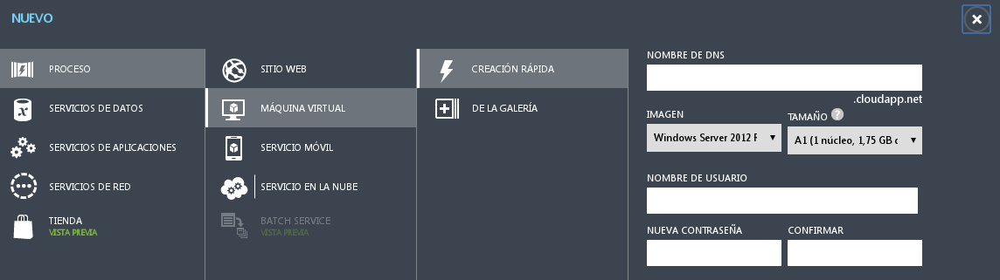
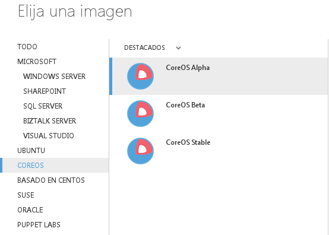
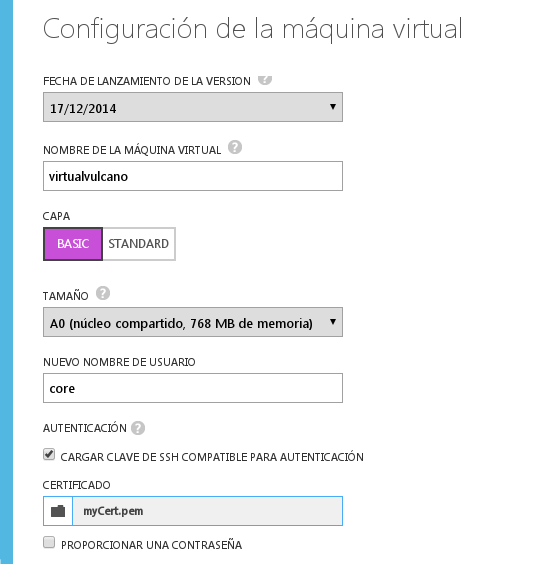
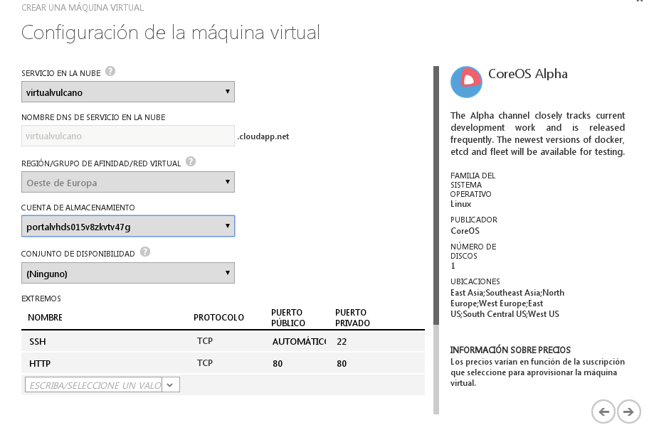
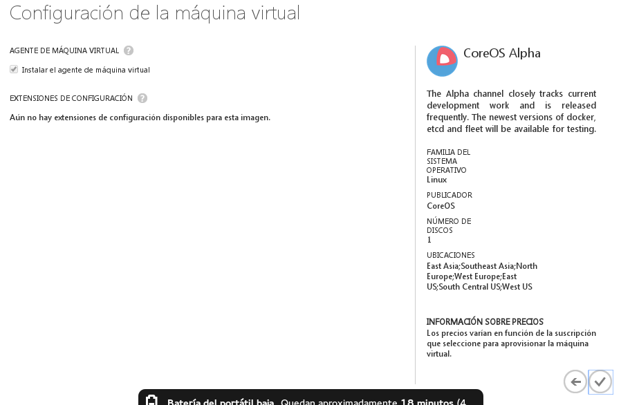
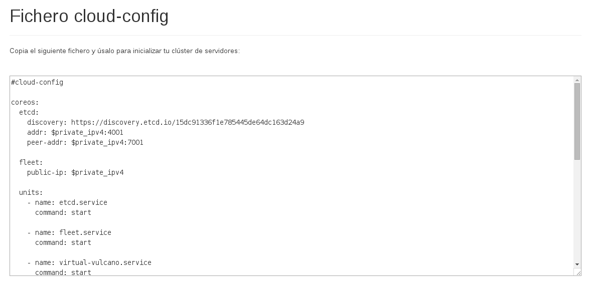

Instalación de la aplicación
============================

> Documenta la instalación de Virtual Vulcano en un SASS concreto como Azure.


### Creación de una máquina virtual

Se entra en el portal de administración de nuestra cuenta y nos vamos a la sección de "Maquinas Virtuales". Entramos en "Crear una máquina virtual".



Seleccionamos la opción para crear una imagen desde la galería. Tenemos que buscar el sistema operativo CoreOS y seleccionar la versión Alpha. Este paso es **importante** porque la versión Beta o Stable no tienen una herramienta que nos va a resultar esencial más adelante y que se implementó recientemente.



Creamos la máquina del tipo que queramos. En el ejemplo vamos a usar Basic A0, que es la máquina más pequeña que podemos crear. Cualquier otra con unos mínimos requerimientos sirve dado que no vamos a necesitar recursos intensivamente para el panel de provisionamiento.

Como nombre de usuario es normal tener en los sistemas CoreOS el usuario ```core```. Si queremos acceder a la máquina por SSH necesitaremos asignarle una clave o una contraseña. La contraseña es el método más fácil; solo tenemos que crear una que tenga los requerimientos de longitud y caracteres que se pide y nos podemos salta la próxima sección del tutorial. Si queremos usar el método más seguro que es asignarle una clave SSH puedes seguir leyendo.


### Crear una clave SSH compatible

En el entorno Linux y para acceder a sitios como Github es muy normal tener una clave (normalmente con el nombre ```id_rsa```) creada en el sistema. El problema es que Azure no sabe leer este tipo de claves públicas y necesita un certificado.

Primeramente, si no tenemos ya la clave SSH creada podemos seguir este estupendo [tutorial de Github](https://help.github.com/articles/generating-ssh-keys/) de como hacerlo. Podemos saltarnos el paso de añadir la clave a Github porque lo importante para ese tutorial es crearla.

Luego tenemos que generar el certificado para Azure. Vamos a usar OpenSSL que es una herramienta libre para generarlo:

```bash 
openssl req -x509 -key ~/.ssh/id_rsa -nodes -days 365 -newkey rsa:2048 -out cert.pem
```

Una vez generado el certificado ```cert.pem``` ya podemos añadirlo en la página web de Azure mientras creamos la máquina.



Hay que crear un servicio (o usar alguno que ya se tenga) y una cuenta de almacenamiento. En concreto delegamos a la propia documentación de Azure como hacerlo si no están ya previamente creadosporque hay mucha variabilidad de instrucciones según el objetivo que queramos conseguir.

Si es importante en este paso dejar abierto dos puertos en la máquina. Primeramente el puerto 22 para poder acceder por SSH a la máquina de provisionamiento en caso de que lo necesitemos; y segundo el puerto 80 para poder acceder al panel de provisionamiento a través de cualquier navegador introduciendo la dirección de la máquina.



Terminamos la instalación de la máquina y esperamos a que se cree y se encienda.




### Creación de cloud-config

Para la configuración de la máquina, se necesita un fichero ```cloud-config.yaml``` que podemos generar en el instalador online de Virtual Vulcano.

Entramos en el [instalador](http://virtual-vulcano.appspot.com/) y generamos un nuevo fichero.



Este instalador nos da dos posibilidades:

1. Usar el comando que nos indica.
2. Usar el fichero cloud-config.

Nosotros en este caso, para Azure, vamos a usar la primera posibilidad. Tan solo copiaremos el comando que nos muestra el instalador y lo usaremos en el siguiente paso.

### Inicializar de la máquina

Si estamos usando la máquina de ejemplo que mencionaba antes es posible que 768 MB de RAM se queden cortos para todo lo que vamos a abrir. Si vemos que tenemos una cantidad de RAM inferior a 1 GB es conveniente habilitar el swap en CoreOS para que no nos quedemos sin recursos y se cierren las aplicaciones. Para habilitar un archivo de swap podemos consultar [este gist](https://gist.github.com/kacinskas/8d58ebce2e4cf6c9a09b).

Entramos en la máquina usando ssh:

```bash 
ssh core@[IP de la máquina]
```

Una vez dentro de la máquina cargamos el fichero de configuración para inicializar el servicio, en nuestro caso, usaremos el comando proporcionado por el instalador:

```bash 
sudo coreos-cloudinit --from-url="[dirección proporcionada por el instalador]"
```

El servicio puede tardar uno o dos minutos en encender mientras MongoDB se inicializa y prepara la base de datos. Una vez que termine se puede acceder al panel de provisionamiento si ponemos la IP de la máquina en cualquier navegador.

