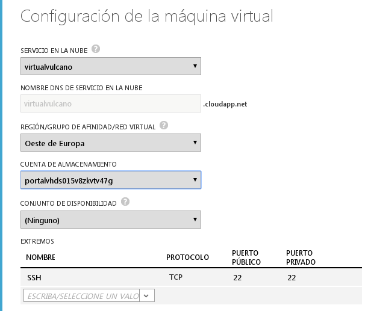
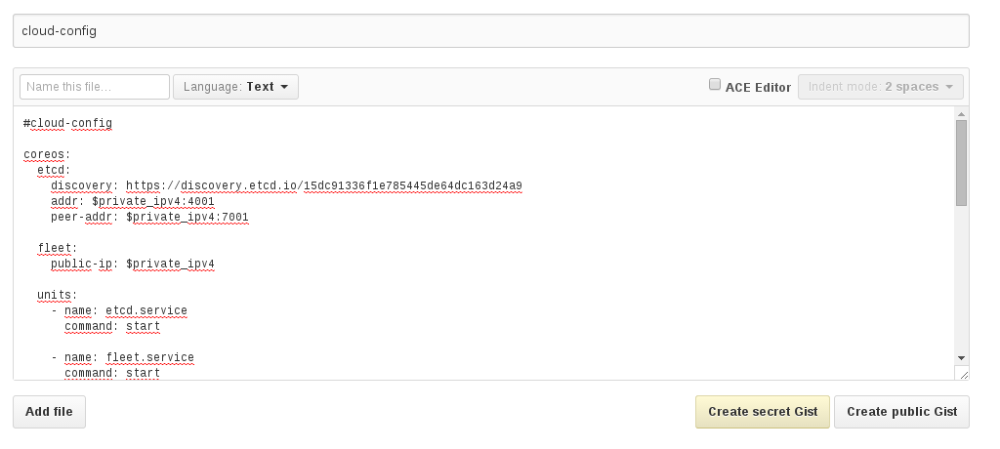
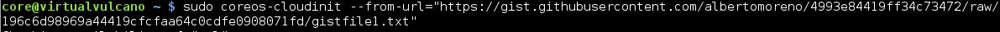

Instalación de la aplicación
============================

Para la instalación de Virtual Vulcano, tendremos que crear una máquina virtual 
en Azure.

Creación de una máquina virtual en Azure
----------------------------------------

Se entra en el portal de administración de nuestra cuenta. Una vez accedido, hay 
que meterse en el apartado "Maquinas Virtuales".
Seguidamente, se hace clic en "Crear una máquina virtual".


Una vez que nos ha aparecido una nueva ventana, se le indica que queremos crear 
una máquina de la galeria.
En la nueva ventana, buscamos en la parte izquierda el sistema CoreOs. En la parte
central se indica la version del sistema, que en este caso se va a utilizar CoreOs
Alpha y clicamos en siguiente.


Una vez elegido el sistema, le indicamos el nombre de la máquina, por ejemplo, 
virtualvulcano. En el tipo de capa, se selecciona Basic, con tamaño A0(nucleo 
compartido, 768 MB de memoria). Como nombre de usuario, lo normal es asignarle
core como nombre de usuario.
Le indicamos que no hay que introducir ninguna contraseña, tan solo hay que cargar
una clave ssh compatible.

### Crear una clave ssh compatible

Normalmente, tenemos una clave ssh con el nombre id_rsa, pero para azure no es 
compatible, por lo que tendremos que generar la clave en un formato .pem.

Para ello, tendremos que introducir en la consola el siguiente comando:
```bash 
openssl req -x509 -key ~/.ssh/id_rsa -nodes -days 365 -newkey rsa:2048 -out myCert.pem
```

Una vez que se tenga la clave ssh en el formato .pem, se lo añadimos en el apartado
"Certificado" y le damos en siguiente.


En este apartado, pide indicar un servicio en la nube, que tenemos ya creado, por
lo que se selecciona el servicio.
Tambien hay creada una cuenta de almacenamiento, que hay que indicarla cuando se
pide. 
En la parte de conjunto de disponibilidad, no se seleciona nada.
Por ultimo en esta parte, dejamos abierto para ssh el puerto 22, tanto público como
privado. Esta opcion viene puesta por defecto.

Una vez esto, le damos a siguiente.



En el ultimo paso, dejamos seleccionado el apartado Instalar el agente de la 
máquina virtual.

Finalmente seleccionamos el botón de finalizar, situado en la parte inferior 
derecha.


Creación de cloud-config
------------------------

Para la configuración de la máquina, se necesita un fichero cloud-config, el cual
vamos a descargar de una página especifica para ello.

Entramos en la pagina web http://virtual-vulcano.appspot.com/.
Una vez en ella, se hace clic en el botón Generar, que devuelve un cloud-config
preparado. 


Una vez obtenido, lo copiamos y lo almacenamos en un gist. Un gist lo podemos generar
entrando en la pagina https://gist.github.com/.
En la descripcion se pone cloud-config como titulo y en el texto copiamos el 
cloud-config dado anteriormente. Despues, hacemos clic en create secret gist.



Una vez creado el gist, le damos al boton Raw y se nos abrirá una ventana nueva.
De dicha ventana, copiamos la dirección.

Configuración de la máquina con cloud-config
--------------------------------------------

Ahora, entramos en la máquina desde la consola. Para ello, hay que mirar en 
azure, la dirección de la máquina virtual, que en este caso es 137.117.145.176.

Para acceder a la maquina virtual, introducimos el siguiente comando: 
```bash 
ssh core@137.117.145.176
```


Una vez dentro, para asignar a la configuración de la maquina el cloud-config, 
hay que introducir el siguiente comando, con la direccion del gist creado anteriormente,
que en este caso es https://gist.githubusercontent.com/albertomoreno/4993e84419ff34c73472/raw/196c6d98969a44419cfcfaa64c0cdfe0908071fd/gistfile1.txt:

```bash 
coreos-cloudinit --from-url="https://gist.githubusercontent.com/albertomoreno/4993e84419ff34c73472/raw/196c6d98969a44419cfcfaa64c0cdfe0908071fd/gistfile1.txt"
```


Una vez terminada la ejecución, nos vamos al navegador e introducimos la direccion
ip de la máquina y aparecerá la página de monitorización de clusters.


